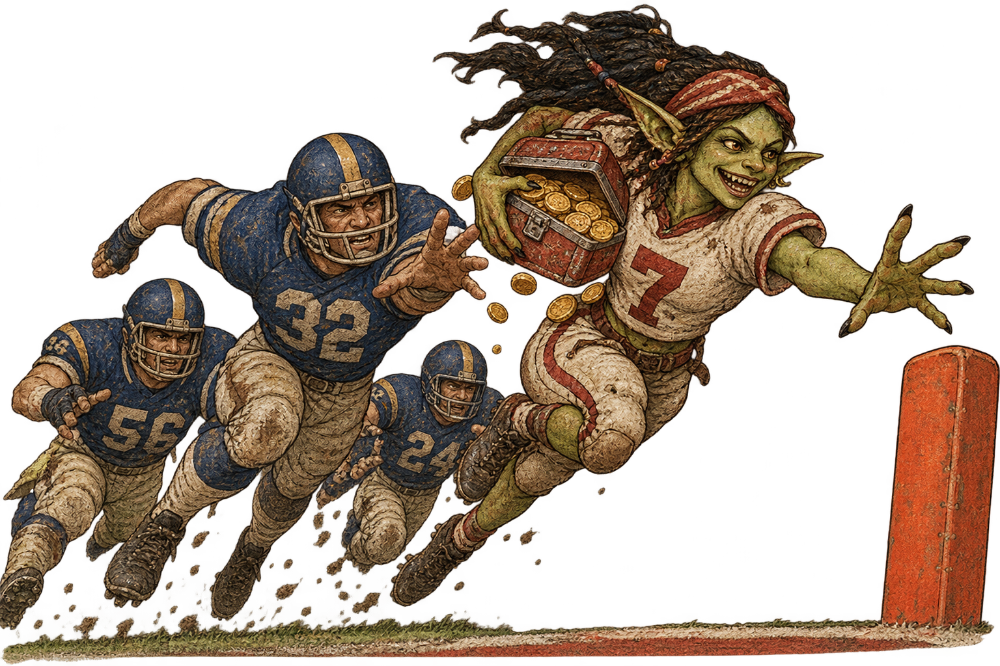

# Lunch Pail

**NFL data infrastructure and market reporting for prediction markets.**

Lunch Pail ingests, validates and stores eleven seasons of NFL data in PostgreSQL, and is building a reporting pipeline that detects NFL game markets on Polymarket and generates structured per-game intelligence reports from them.

Everything runs on free, public data sources. No paid subscriptions required.

> **Status:** The historical data layer is complete and validated. The market reporting pipeline is in active development as of September 25, 2026. What you're reading now is based on the build as it was on that date. Happy Chuseok. Hopefully we will remember to update this README.md frequently enough so that it reflects ongoing changes made in the repository in the future.

---

## What this is for

Two audiences:

**If you want NFL data**, the ingestion layer gives you a reproducible, validated PostgreSQL corpus covering 2014–2024 — play-by-play, rosters, injuries, snap counts, depth charts, team aggregates, stadium metadata and per-game weather — set up with a handful of commands and verified by an automated quality suite.

**If you want market intelligence**, the reporter pipeline (in development) detects active NFL markets on Polymarket, gathers the context that matters for each game, and writes one structured markdown report per fixture — designed to be read whole by a human analyst or an LLM-based reasoning system, rather than queried.

Lunch Pail supplies data. It does not tell you what to bet.

---

## Data at a glance

The historical corpus, once ingested:

| Table | Rows |
|---|---|
| `play_by_play` | 508,135 |
| `rosters` | 457,954 |
| `depth_charts` | 376,227 |
| `snap_counts` | 262,259 |
| `injuries` | 57,576 |
| `players` | 15,473 |
| `team_stats` | 5,758 |
| `games` / `schedules` | 2,879 each |
| `weather` | 2,879 |
| `stadiums` | 39 |

Eleven seasons, 2014 through 2024. Weather covers all 2,033 outdoor games; indoor and retractable-roof venues are recorded as such rather than given null values silently.

---

## Background: v1, and why it changed

Lunch Pail began as an XGBoost moneyline prediction engine. The plan was a six-phase build: data infrastructure, feature engineering, model training, calibration, validation, deployment.

**Phase 1 shipped.** The data infrastructure is what you see in this repository — and it turned out to be the durable part.

**Phases 2 through 6 did not.** Before model development began, the project pivoted. Supplying rich, well-structured game data to a capable reasoning system turned out to deliver useful output far sooner than training, calibrating and validating a model from scratch. The prediction layer moved out of the pipeline; the pipeline's job became data supply.

The XGBoost work is deferred, not deleted. The historical corpus that would train it is intact and ready if the model is ever revived. Nothing in v2 depends on it.

---

## v2: the market reporter

The current build detects NFL game markets on Polymarket and writes one report per game.

**What goes into a report:**

- **Market data** — implied probability per side, trading volume, open interest, recent trade-flow direction, market URL and close time. Moneyline leads; spreads and totals are captured as secondary context.
- **Team performance** — rolling recent-form statistics for both teams
- **Injury report** — current-week designations for key players
- **Weather** — game-time conditions for outdoor venues, explicitly omitted for domes
- **Situational context** — home/away, rest differential, divisional matchup, week of season
- **Metadata** — generation timestamp and per-source availability status

**Design principles the pipeline holds to:**

- **Free data only.** Every source is publicly accessible without a paid subscription.
- **Graceful degradation.** A failed data source degrades the report; it never crashes the run.
- **Missing data is loud.** An unavailable source is marked explicitly in the report body. Nothing is silently omitted, and no absent value is rendered as a zero.
- **Freshness is stated.** Every report carries a generation timestamp. Stale data is never presented as current.
- **Reports expire.** Once a game finishes, its report is removed. The output directory holds only actionable fixtures.

**Current state:** market detection, data extraction and report generation are in development. The report structure and data sources above are the target; see the roadmap below for what has landed.

---

## Requirements

- Python 3.11+
- PostgreSQL 14+

Core dependencies include `nflreadpy` (which returns Polars DataFrames), `polars`, `psycopg2` and `requests`.

---

## Quickstart

```bash
git clone https://github.com/sm33f3r/lunch-pail.git
cd lunch-pail

python -m venv venv
source venv/bin/activate        # Windows: venv\Scripts\activate

pip install -r requirements.txt
```

Configure `.env` with your PostgreSQL connection details, then build the schema and ingest:

```bash
python scripts/migrate.py       # create tables and indexes
python ingest.py                # historical ingest, 2014-2024
python build_team_stats.py      # team-level aggregates
python ingest_weather.py        # per-game weather
python validate_data.py         # 10-check data quality suite
```

The full historical ingest is substantial — play-by-play alone is half a million rows and runs season by season in chunks. Expect it to take a while on first run. The migration is idempotent, so re-running it is safe.

`validate_data.py` should report 10/10 checks passing before you rely on the data.

---

## Project structure

```
ingest.py                 # historical ingest: schedules, rosters, injuries,
                          #   snap counts, depth charts, play-by-play
build_team_stats.py       # team aggregates: EPA, third down, red zone, PPG
ingest_weather.py         # per-game weather via Open-Meteo
patch_null_weather.py     # repairs null weather rows on outdoor games
validate_data.py          # automated data quality suite

data/                     # seed files, including stadium metadata
scripts/                  # schema migration and utilities
docs/                     # schema reference, data dictionary, quality report
reporter/                 # v2 market reporting pipeline (in development)
reports/                  # generated per-game reports
```

---

## Data sources

| Source | Provides | Access |
|---|---|---|
| [nflverse / nflreadpy](https://github.com/nflverse) | Schedules, play-by-play, rosters, injuries, snap counts, depth charts | Free, no auth |
| [Open-Meteo](https://open-meteo.com/) | Historical and forecast weather by coordinate | Free, no auth |
| [Polymarket](https://docs.polymarket.com/) | Active markets, prices, volume, open interest, trades | Free, no auth for public market data |

Stadium metadata — coordinates, roof type and timezone across all 32 franchises plus historical relocations — ships as a seed file in this repository.

DVOA is deliberately absent. Football Outsiders shut down in 2023 and DVOA now sits behind a paid subscription; EPA from nflverse covers comparable analytical ground without cost.

---

## Known limitations

Documented honestly, because they affect what you can do with the data:

- **`turnover_differential` is zero across all rows.** Interception and fumble flag columns were not included in the play-by-play ingest schema. Requires a schema addition and re-ingest to fix.
- **Injury practice status is Friday only.** The nflverse injuries schema carries a single `practice_status` field, so `practice_status_wed` and `practice_status_thu` are null for every historical record.
- **Snap counts use a different player ID system.** They key on `pfr_player_id`, while rosters, injuries, depth charts and play-by-play use `gsis_id`. No crosswalk exists yet, so joining snap counts to other player data requires building one.
- **Play-by-play EPA is null on ~1.14% of plays.** This is structural — kickoffs, extra points, penalties and kneel-downs have no computable EPA. Expected, not a defect.

---

## Roadmap

| | Status |
|---|---|
| Historical data infrastructure (2014–2024) | ✅ Complete, validated |
| Polymarket market detection and reporting | ✅ Complete, validated |
| Game data enrichment — team form, injuries, weather | 🔨 In development |
| Scheduled automated runs | ⏳ Planned |
| XGBoost prediction engine | ⏸ Deferred indefinitely |

---

## Disclaimer

Lunch Pail is a data tool. It produces reports; it does not produce financial advice, predictions you should act on, or any guarantee of accuracy.

Prediction markets involve real financial risk, and their legal status varies by jurisdiction. Anyone using this software to inform real-money positions does so entirely at their own risk and is responsible for their own compliance. The authors accept no liability for any loss.

Data is sourced from third-party providers and may be incomplete, delayed or wrong. Verify anything that matters before relying on it.

---

## License

MIT
